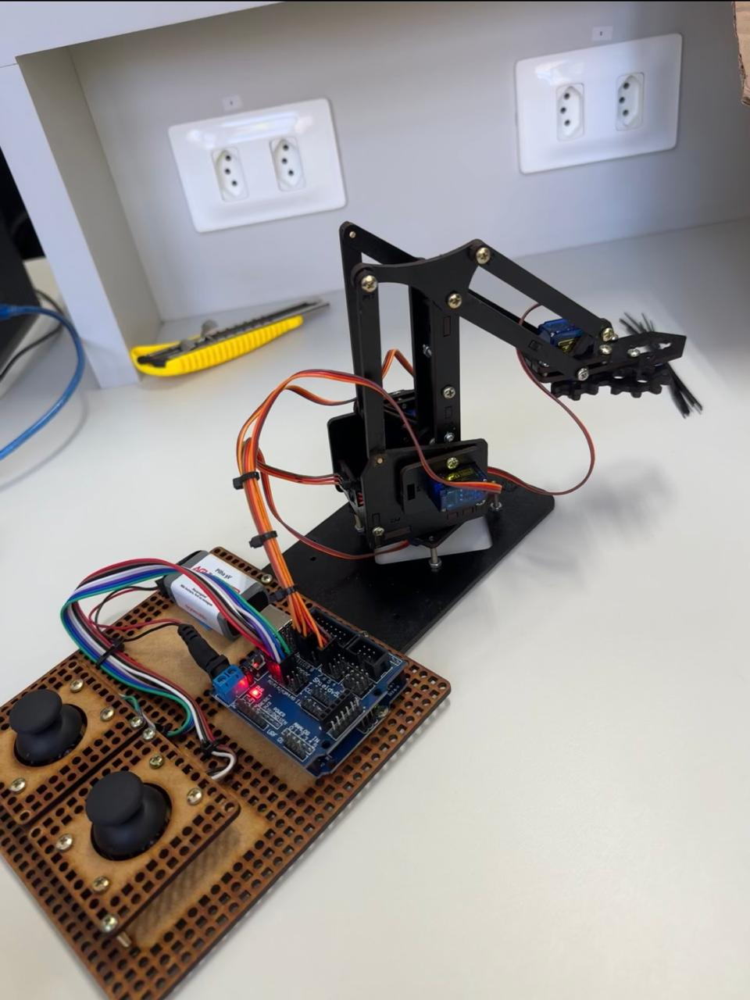

# ICEI / CIÊNCIA DA COMPUTAÇÃO - CAMPUS POÇOS DE CALDAS  
## REGISTRO E MONITORAMENTO DAS PRÁTICAS DE EXTENSÃO

**Disciplina: Seminários III / Turno: Manhã**

**Comunidade atendida:** Centro Municipal de Ensino Especializado Dr. Tarso de Coimbra  
**Data/hora da oficina:** 02/07/2025 - 15:00  
**Grupo:** Otávio Bruno, Luis Bordin, Angelo Henrique.
---

## 🧠 ATIVIDADE PROPOSTA
**Apresentação de braço robótico com Arduino**

---

## 🎯 OBJETIVO DA ATIVIDADE
Estimular o interesse dos alunos pela tecnologia e pela robótica, por meio da demonstração prática de um braço mecânico funcional. A atividade visa despertar a curiosidade e introduzir conceitos básicos de automação e programação de forma lúdica e acessível.

---

## 🛠️ RECURSOS UTILIZADOS
● Arduino UNO
● Servo motores
● Protoboard e jumpers
● Fonte de energia
● Notebook com IDE Arduino
● Projetor
● Papel e lápis para anotações

---

## 📚 DESENVOLVIMENTO
1. A equipe monta o braço robótico previamente, programado para realizar movimentos simples como pegar e soltar objetos.
2. Durante a oficina, os alunos observam a montagem e o funcionamento do braço em tempo real, com explicações sobre cada componente e suas funções.
3. É promovida uma breve interação onde os alunos podem sugerir movimentos e observar o código responsável por isso.

---

## ✅ RESULTADOS (AVANÇOS E DIFICULDADES)
Resultado ainda a ser realizado.

---

## 📷 FOTOS
| Braço Mecânico         | Foto 2 - Alunos no laboratório |
|------------------------|-------------------------------|
|  |  |

---

## 📎 MATERIAL DESENVOLVIDO
> *● Código-fonte do Arduino utilizado
● Foto da montagem do braço robótico
● Slides de explicação dos componentes*
